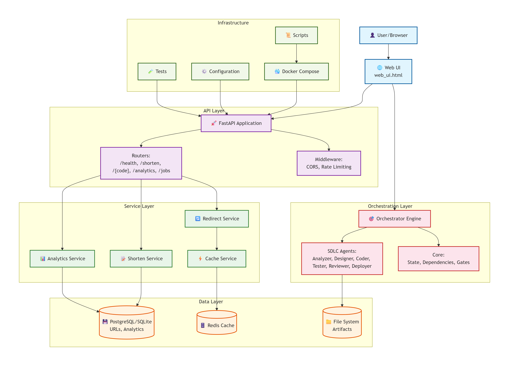
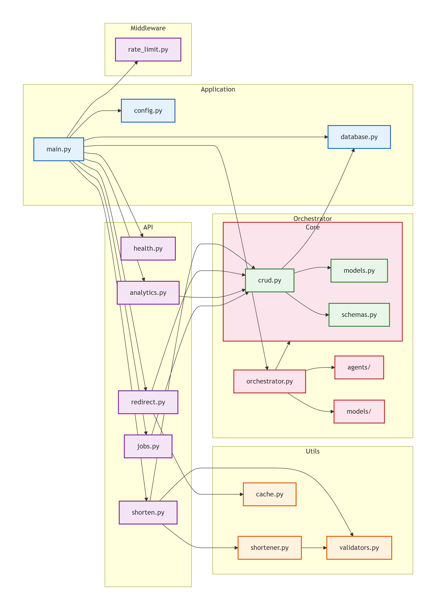
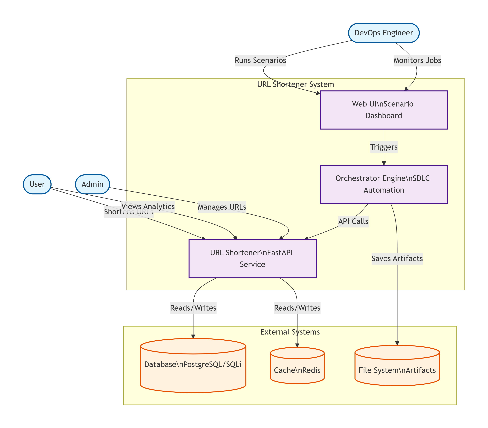
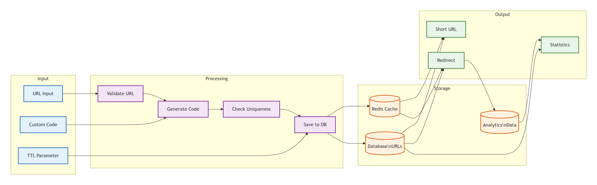
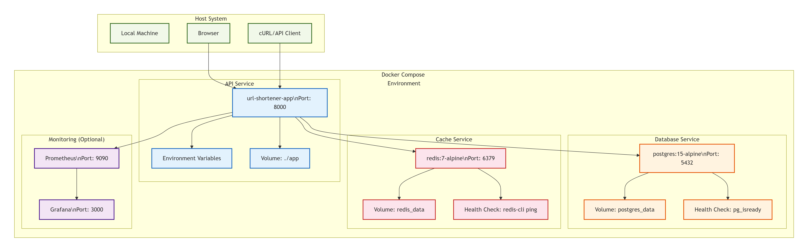

# Project Architecture

## 1. Overview

This project is a modular URL shortener service with a browser-based UI and an orchestration layer for scenario-based SDLC workflows. The application is built as a FastAPI monolith with clear separation between API routes, business logic, persistence, caching, and orchestration agents.

At a high level, the system has three main concerns:

- URL shortening and redirect service
- Analytics and operational monitoring
- Agentic scenario orchestration for greenfield, brownfield, and ambiguous requirements



---

## 2. High-level layout

```text
url_shortener/
├── app/                       # Main FastAPI application
│   ├── middleware/            # Request middleware (rate limiting)
│   ├── routers/               # API endpoint groups
│   ├── utils/                 # Shortening, caching, validators
│   ├── config.py              # Environment and application settings
│   ├── database.py            # SQLAlchemy engine and Base metadata
│   ├── models.py              # ORM models
│   ├── schemas.py             # Pydantic validation/response schemas
│   ├── crud.py                # DB access helpers
│   ├── jobs.py                # Job tracking and state helpers
│   └── main.py                # FastAPI app entry point
├── orchestrator/               # Scenario orchestration engine
│   ├── agents/                # Specialized execution agents
│   ├── core/                  # State, dependency graph, validation logic
│   ├── models/                # Orchestration task and stage models
│   └── orchestrator.py        # Execution coordinator
├── scenarios/                  # Example SDLC scenario implementations
├── tests/                     # API and behavior tests
├── web_ui.html                # Browser UI served by the API
├── docker-compose.yaml        # Local container orchestration
├── requirements.txt           # Python dependencies
└── README.md                  # User setup and usage notes
```

---

## 3. Core runtime architecture



### 3.1 API layer

The FastAPI app is initialized in [app/main.py](app/main.py). This is the central entry point for the service.

Responsibilities:

- Creates the FastAPI application
- Registers middleware such as CORS and rate limiting
- Mounts routers for health, shorten, redirect, and analytics
- Serves the UI at the root route when HTML is requested
- Exposes job APIs used by the browser UI
- Initializes the database schema on startup

### 3.2 Router modules

The app is organized by feature, using router modules under [app/routers](app/routers):

- [app/routers/health.py](app/routers/health.py): health checks and service status
- [app/routers/shorten.py](app/routers/shorten.py): create short URLs
- [app/routers/redirect.py](app/routers/redirect.py): resolve short codes and redirect users
- [app/routers/analytics.py](app/routers/analytics.py): click and usage analytics reporting

Each router focuses on request/response boundaries, while the actual business logic is delegated to utilities and CRUD helpers.

### 3.3 Domain and persistence layer

The persistence model is split into a few distinct components:

- [app/database.py](app/database.py): SQLAlchemy engine, sessions, and Base metadata
- [app/models.py](app/models.py): ORM models for URLs, click tracking, and related entities
- [app/schemas.py](app/schemas.py): Pydantic models for request validation and response shaping
- [app/crud.py](app/crud.py): database operations for create/read/update flows

This separation keeps database concerns away from the API surface and makes the service easier to evolve.



### 3.4 Utility and service layer

The [app/utils](app/utils) package contains reusable service logic:

- [app/utils/shortener.py](app/utils/shortener.py): short-code generation and URL shortening rules
- [app/utils/cache.py](app/utils/cache.py): cache wrapper and lookup logic
- [app/utils/validators.py](app/utils/validators.py): request validation and normalization

This layer acts as the business logic boundary between API endpoints and data access.

### 3.5 Background jobs and operational state

The app also contains job-tracking support in [app/jobs.py](app/jobs.py), which stores execution state for asynchronous or scenario-driven workflows. The browser UI uses these job endpoints to display metrics, status, and recent results.

---

## 4. Request flow

A typical shortening request follows this path:

1. Browser or client sends a POST request to /shorten
2. FastAPI route validates input using Pydantic schemas
3. Service logic generates a short code and optional TTL/custom code
4. The app saves the URL record to the database
5. A cache layer is updated for fast redirect lookups
6. A response is returned with the short URL and code

Redirect flow:

1. Client requests /<short_code>
2. API resolves the short code to the destination URL
3. Cache is checked before hitting the database
4. Analytics are recorded for clicks and metadata
5. Client is redirected to the original URL



---

## 5. Orchestration architecture

The project includes an orchestration subsystem under [orchestrator](orchestrator) for agent-based SDLC execution. This is not the core URL shortener logic; it is a scenario engine that coordinates multi-step tasks such as analysis, design, coding, testing, review, and deployment.

### 5.1 Main orchestrator

[orchestrator/orchestrator.py](orchestrator/orchestrator.py) is the orchestration coordinator.

It is responsible for:

- creating an orchestration context
- creating task objects for each stage
- ordering tasks using dependency rules
- invoking the correct agent for each stage
- validating gates before and after execution
- tracking completion/failure state

### 5.2 Agent model

The [orchestrator/agents](orchestrator/agents) package contains specialized agents for each SDLC stage:

- AnalyzerAgent
- DesignerAgent
- CoderAgent
- TesterAgent
- ReviewerAgent
- DeployAgent

Each agent handles a distinct stage in the lifecycle and contributes to the decision pipeline.

### 5.3 State and dependency management

The orchestration core includes:

- [orchestrator/core/state_manager.py](orchestrator/core/state_manager.py): state persistence and tracking
- [orchestrator/core/dependency_graph.py](orchestrator/core/dependency_graph.py): dependency ordering between tasks
- [orchestrator/core/validators.py](orchestrator/core/validators.py): gate validation logic and quality checks
- [orchestrator/models/task_models.py](orchestrator/models/task_models.py): task, stage, and context definitions

This layer enables scenario-based execution such as:

- greenfield implementation
- brownfield modification
- ambiguous requirement clarification

---

## 6. Presentation layer

The browser UI is a single HTML file: [web_ui.html](web_ui.html).

It contains:

- scenario selection
- URL shortening inputs
- control buttons for demo and approval flows
- job history and metrics
- status panels and event logs

The frontend talks to the API through fetch and WebSocket patterns, allowing live job monitoring without a separate frontend framework.

---

## 7. Data and infrastructure

This project is structured as a lightweight production-style service and is designed to run with:

- SQLite or similar lightweight relational DB for persistence
- Redis-style cache support for redirect lookup optimization
- FastAPI for HTTP API delivery
- Docker Compose for local service orchestration

The repository includes Docker config and startup scripts, indicating that the app is intended to be easy to run in a containerized environment.



---

## 8. Architectural style

This project follows a layered monolith architecture rather than a full microservice decomposition.

Benefits:

- smaller deployment footprint
- easier local development
- clear module boundaries
- support for both operational features and orchestration experiments

Trade-offs:

- larger code boundaries than a microservice system
- orchestration and service logic are not fully separated into independent services
- UI and API logic are combined in a single application surface

---

## 9. Summary

The project is best understood as a layered application:

- API and route layer for external access
- Service and utility layer for shortening, validation, and cache logic
- Persistence layer for database operations and analytics storage
- UI layer for operator interaction and monitoring
- Orchestration layer for scenario-driven SDLC execution

This combination makes it both a practical URL-shortening product and a demonstration platform for agentic workflow orchestration.
