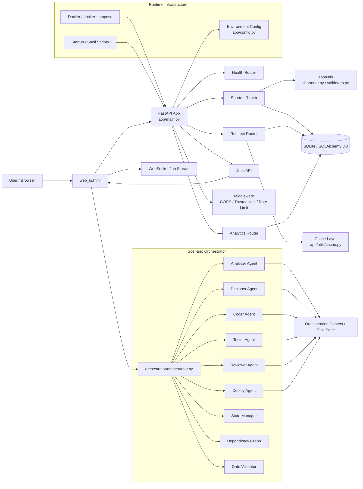

# System Diagram

## Overview

This project is a layered web application that combines a URL-shortening service with an orchestration engine for scenario-driven SDLC workflows.

## Component responsibilities

### Client layer
- Browser-based UI served from the FastAPI root route
- Uses fetch calls to interact with the API
- Reads job status and metrics through job endpoints
- Uses WebSocket for live job progress updates

### API layer
- Exposes shorten, redirect, analytics, health, and jobs endpoints
- Validates incoming requests
- Maintains middleware for security and rate limitations
- Serves the UI and scenario metadata

### Data layer
- Stores URL mappings and analytics records in a SQLAlchemy-backed database
- Uses cache logic for redirect lookups and response acceleration
- Maintains operational state for background jobs and scenario execution

### Orchestration layer
- Coordinates scenario workflows using a dependency graph
- Runs staged agents for analysis, design, coding, testing, review, and deployment
- Applies human approval and validation gates between stages
- Tracks task state through the orchestrator state manager

## Runtime flow

1. User opens the browser UI and selects a scenario.
2. The UI sends a URL shortening request to the FastAPI API.
3. The API validates input and stores the short URL record.
4. Redirect and analytics requests use the same backend data services.
5. The scenario orchestrator can run multi-stage SDLC workflows from the same project environment.
6. Job state is returned to the UI for monitoring and display.

## Summary

This system is a layered application: a production-style URL service backed by a database and cache, plus an orchestration subsystem for automated scenario execution. The architecture keeps the user-facing API, data access, and process automation logically separated while still running in a single cohesive codebase.
